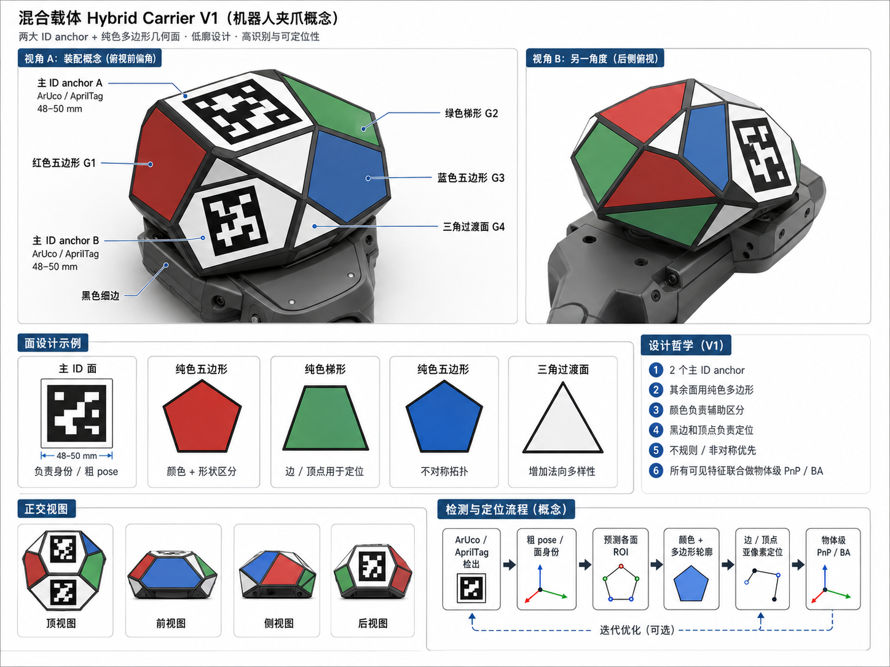

# Hybrid Detector

Research-grade 6-DoF pose estimation for a rigid target that combines decoded
fiducial anchors with CAD-defined coloured facets and sub-pixel boundary
measurements.

> IP status: private research repository. No license is granted. Complete the
> patent/publication review in [docs/ip_and_publication.md](docs/ip_and_publication.md)
> before any public disclosure.



## Why a hybrid target?

A fiducial marker gives identity and a coarse metric pose, but its useful image
area collapses under distance, obliquity, and occlusion. A large coloured CAD
surface is easy to see but ambiguous by itself. This detector uses each source
only for what it can establish:

1. ArUco IDs establish correspondence and initialize pose.
2. The initialized CAD pose predicts visible, front-facing facet regions.
3. Colour supports or rejects those predictions inside the projected regions.
4. Sub-pixel normal profiles measure physical facet boundaries.
5. A robust joint solve refines pose from anchor corners and accepted edges.
6. Every stage reports its evidence and refuses underconstrained solutions.

The shipped 0907 model uses three measured 47.24 mm `DICT_6X6_50` anchors
(IDs 30, 31, and 32) plus coloured facets. Geometry, paste rotations, printing
assumptions, and the socket centre are data, not constants hidden in code.

## Independence

This repository is self-contained. Runtime code imports only the
`hybrid_detector` package and third-party Python dependencies. It does not
import, locate, or shell out to another project. An automated repository test
guards that boundary.

## Quick start

```bash
cd ~/Codes/hybrid_detector
python3 -m venv .venv
source .venv/bin/activate
python -m pip install -e '.[dev]'
pytest
python examples/single_image.py --output outputs/example
```

The example uses the included 1920x1080 fisheye image, its camera calibration,
and the measured 0907 descriptor. It writes:

- `outputs/example/report.json`: pose and stage-by-stage evidence;
- `outputs/example/overlay.jpg`: anchors, visible facets, edge samples, and axes.

Equivalent command-line use:

```bash
hybrid-detect \
  --model assets/models/hybrid_carrier_v1_20260907.json \
  --image cam14=examples/data/cam14_ep1_frame000000.jpg \
  --camera cam14=examples/data/cam14_intrinsics.json \
  --out outputs/example/report.json \
  --overlay outputs/example
```

## Python API

```python
import cv2
import numpy as np

from hybrid_detector import CameraCalibration, HybridCarrierModel, detect_carrier

image = cv2.imread("frame.jpg")
camera = CameraCalibration(
    name="camera",
    serial="",
    width=image.shape[1],
    height=image.shape[0],
    K=np.asarray(...),
    D=np.asarray(...),
    T_base_cam=np.eye(4),
    model="fisheye",
)
model = HybridCarrierModel.from_json("assets/models/hybrid_carrier_v1_20260907.json")
result = detect_carrier(image, camera, model, min_anchors=2)
if result.success:
    T_camera_target = result.T_base_rig
```

## Repository map

- `src/hybrid_detector/detector.py`: staged detector and robust pose refinement.
- `src/hybrid_detector/calibration.py`: pinhole/fisheye camera contract.
- `src/hybrid_detector/marker_rig.py`: multi-view corner geometry and projection.
- `src/hybrid_detector/step.py`: deterministic AP242 geometry/colour reader.
- `src/hybrid_detector/cli/`: detection, CAD build, printing, rendering, and A/B tools.
- `assets/models/`: measured descriptors, marker layout, and TCP bundle.
- `assets/cad/`: original and colour-annotated STEP files.
- `assets/print/`: exact-scale PDF, manifest, and installation guide.
- `examples/`: runnable real-image example.
- `docs/`: method, evidence, limitations, and disclosure plan.
- `tests/`: synthetic ground-truth and independence checks.

## Current evidence

On the 2026-09-09 seven-camera bench capture, the detector produced a joint pose
for 2403/2403 processable frames. Median joint reprojection error was 1.261 px;
median reported position and rotation uncertainty were 0.061 mm and 0.0372 deg.
These are repeatability/internal-consistency results, not an independent
traceable accuracy certification. See [docs/validation.md](docs/validation.md).

## Citation and license

`CITATION.cff` intentionally contains author and repository placeholders.
Resolve inventorship before replacing them. Until an explicit license is added,
the contents remain all rights reserved; see [LICENSE-PENDING.md](LICENSE-PENDING.md).
