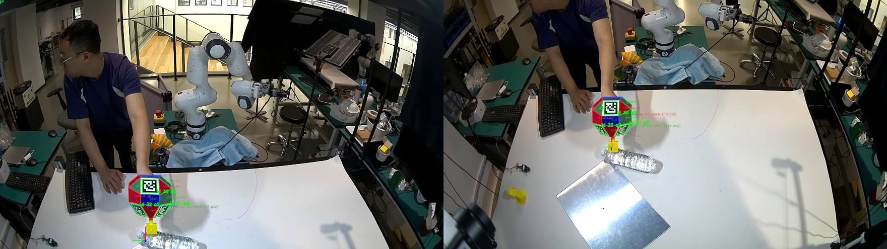

# Validation status

## 2026-09-09 bench capture

Seven calibrated fisheye cameras observed the 0907 target. Two processable
episodes contributed 2403 frames and 16,821 camera-frame opportunities.

| Metric | Result |
|---|---:|
| Camera views with a detection | 10,249 / 16,821 (60.9%) |
| Joint poses solved | 2403 / 2403 |
| Median cameras per joint pose | 7 |
| Median corners per joint pose | 52 |
| Median joint reprojection RMSE | 1.261 px |
| P95 joint reprojection RMSE | 1.872 px |
| Median reported position sigma | 0.061 mm |
| P95 reported position sigma | 0.077 mm |
| Median reported rotation sigma | 0.0372 deg |
| P95 reported rotation sigma | 0.0486 deg |
| Median joint-vs-camera-fusion delta | 1.170 mm |
| P95 joint-vs-camera-fusion delta | 2.620 mm |

Per-camera detection rates ranged from 25.8% to 87.0%. This is compatible with a
100% joint-pose rate: the joint estimator needs enough total views per time
step, not every camera to succeed.

## Earlier controlled check

A 40-frame sample solved 40/40 frames with a median of seven cameras. Joint
reprojection RMSE was 1.590 px, with 142 edge samples per frame and 0.77 px edge
RMSE. Facet refinement moved the anchor bundle-adjustment answer by less than
0.05 mm in that sample.

## What the evidence establishes

- The measured model and dictionary produce detections on real images.
- Multi-camera anchor geometry is numerically stable on the captured trajectory.
- Facet boundaries reach the optimizer and remain close to the anchor solution.
- The system exposes per-view evidence and can reject weak measurements.

## What it does not establish

- Traceable absolute 6-DoF accuracy against an independent metrology system.
- Cross-day camera calibration stability.
- Generalization across lighting, paint batches, printers, and lenses.
- Remove/reseat repeatability of the carrier socket.
- A measured target-to-tool roll convention.
- Superiority over all modern fiducial or learned keypoint baselines.

The current CAD-derived target-to-TCP bundle is deliberately marked
`validated: false`. Its translation is zero by construction at the socket
centre; its rotation is a convention rather than a measurement.

## Required publication experiments

1. Register an independent ground-truth system and report translation and
   rotation error, not reprojection error alone.
2. Run repeated captures across days, cameras, lighting, ranges, and incidence
   angles with frozen parameters.
3. Compare against AprilTag/ArUco, ChArUco/board, and at least one strong
   correspondence or learned-pose baseline.
4. Report detection rate and error conditional on anchor count and occlusion.
5. Perform ablations: anchors only, facets only, anchors + colour, and full
   anchor + colour + sub-pixel edges.
6. Separate body-scale, sticker-scale, camera calibration, and mounting errors.
7. Publish failure cases and predefine exclusion thresholds.
